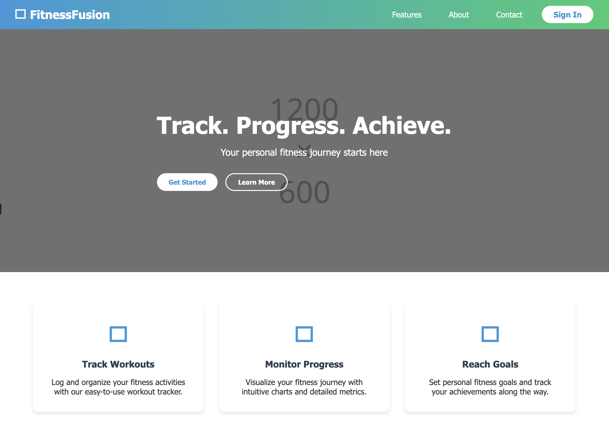
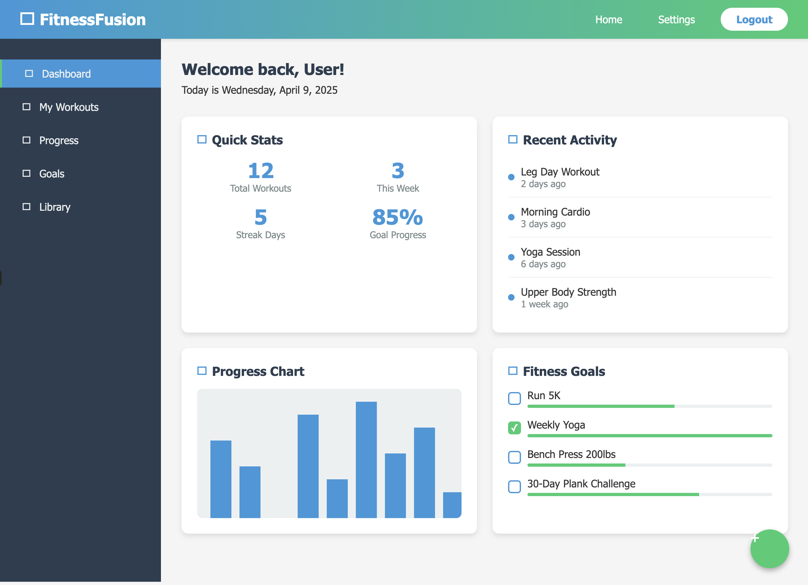

# FitnessFusion

## Project Theme
FitnessFusion will be a basic fitness tracking application that allows users to log workouts and track their fitness progress over time.

## What FitnessFusion Will Do
1. Allow users to create simple fitness profiles
2. Provide basic workout tracking functionality
3. Generate simple progress visualizations 
4. Include a small library of workout suggestions
5. Enable basic goal setting and achievement tracking

## Target Audience
- Fitness beginners and casual enthusiasts
- People looking to establish consistency in their workouts
- Individuals who want a straightforward way to track their fitness journey

## Data Management
The application will manage:
1. **User Profile Data**:
   - Basic information (name, age, weight, height)
   - Simple fitness goals

2. **Workout Data**:
   - Exercise logs (type, sets, reps, weight)
   - Workout dates and durations

3. **Progress Metrics**:
   - Weight tracking
   - Simple performance metrics

## Technical Implementation
- Frontend: HTML, CSS, JavaScript with minimal frameworks
- Backend: Simple Node.js server
- Database: MongoDB for data storage
- Basic authentication system

## Core Features (4-week MVP)
1. User account system
2. Workout logging functionality
3. Simple progress charts
4. Pre-defined exercise library
5. Mobile-responsive design

## Stretch Goals (If Time Allows)
1. Social sharing feature (share workouts to social media)
2. Simple workout planning calendar
3. Basic achievement badges

## Project Timeline
- Week 1: Setup, design, and user authentication
- Week 2: Core workout tracking functionality
- Week 3: Progress visualization and exercise library
- Week 4: Testing, refinement, and deployment

## Project Wireframe

